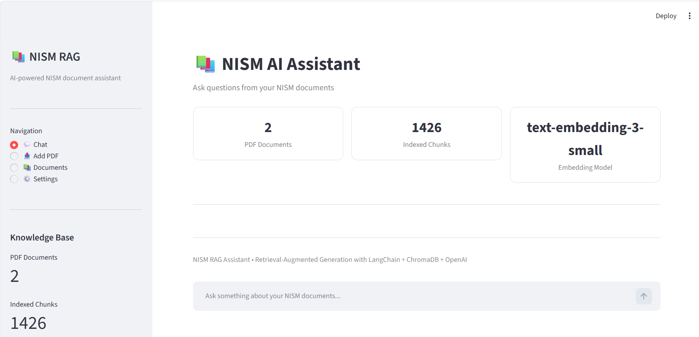

# 📚 NISM RAG Assistant — Retrieval-Augmented Generation with LangChain & ChromaDB

A complete **Retrieval-Augmented Generation (RAG)** application for asking questions from NISM PDF documents.

The application uses **LangChain, OpenAI Embeddings, ChromaDB, and Streamlit** to build a document-grounded question-answering system.

Instead of asking an LLM to answer questions only from its pretrained knowledge, this project retrieves relevant information from uploaded NISM documents and provides that information to the LLM as context before generating the final answer.

---

## 🚀 Project Overview
The **NISM RAG Assistant** allows users to:

* 📄 Upload NISM PDF documents
* 🔍 Automatically process and index PDF documents
* ✂️ Split documents into smaller chunks
* 🧠 Convert chunks into vector embeddings
* 💾 Store embeddings in a persistent ChromaDB vector store
* 🔎 Perform semantic similarity search
* 🤖 Generate answers using an OpenAI language model
* 📚 Display source documents and page numbers
* ♻️ Avoid processing duplicate documents
* ➕ Add new documents incrementally
* 💬 Ask multiple questions through a Streamlit chat interface
* ⚙️ Configure retrieval settings
* 📊 View indexed document information

The main goal is to build a practical RAG pipeline that can be used as a **study assistant for NISM-related PDF content**.

---

## 🖥️ Application Preview

The application provides a Streamlit-based interface for interacting with
the uploaded NISM documents.

### Chat Interface



Users can ask questions about the uploaded NISM documents and receive
answers based on the retrieved document context.


---

# 🧠 What is RAG?

**RAG stands for Retrieval-Augmented Generation.**

A traditional LLM works approximately like:

```text
User Question
      ↓
     LLM
      ↓
   Answer
```

The problem is that the LLM may:

* Not know the private documents
* Not have access to the latest document content
* Generate unsupported information
* Hallucinate when information is unavailable

A RAG system introduces a retrieval step:

```text
                 User Question
                       │
                       ▼
              Search Knowledge Base
                       │
                       ▼
              Relevant Document Chunks
                       │
                       ▼
             Question + Retrieved Context
                       │
                       ▼
                      LLM
                       │
                       ▼
                    Answer
```

Therefore:

```text
Retrieval + Generation = RAG
```

---

# 🏗️ Complete System Architecture

The complete application can be divided into two major phases.

## Phase 1 — Document Ingestion

```text
                PDF Documents
                      │
                      ▼
                PyPDFLoader
                      │
                      ▼
              Document Objects
                      │
                      ▼
                  Metadata
                      │
                      ▼
              Text Chunking
                      │
                      ▼
                   Chunks
                      │
                      ▼
             OpenAI Embeddings
                      │
                      ▼
                  ChromaDB
                      │
                      ▼
            Persistent Vector Store
```

---

## Phase 2 — Question Answering

```text
                  User Question
                        │
                        ▼
                Query Embedding
                        │
                        ▼
                ChromaDB Search
                        │
                        ▼
               Top-K Relevant Chunks
                        │
                        ▼
              Context + User Question
                        │
                        ▼
                    OpenAI LLM
                        │
                        ▼
                  Generated Answer
                        │
                        ▼
                 Streamlit UI
```

---

# 🔄 End-to-End RAG Pipeline

The complete workflow is:

```text
PDF
 ↓
Load
 ↓
Metadata
 ↓
Chunk
 ↓
Embedding
 ↓
Vector Store
 ↓
User Question
 ↓
Question Embedding
 ↓
Similarity Search
 ↓
Top-K Relevant Chunks
 ↓
Prompt Construction
 ↓
LLM
 ↓
Grounded Answer
 ↓
Source / Page Display
```

---

# 📁 Project Structure

```text
RAGFlow-End-to-End-Retrieval-Augmented-Generation-with-LangChain-ChromaDB/
│
├── app.py
│
├── rag/
│   ├── __init__.py
│   ├── ingestion.py
│   ├── vectorstore.py
│   ├── indexer.py
│   ├── qa.py
│   └── resgistry.py
│
├── Docs/
│   ├── NISM-8.pdf
│   └── NISM-15.pdf
│
├── vector_store/
│
├── notebooks/
│   ├── 1.0_rag_with_own_text.ipynb
│   ├── 2.0_rag_doc.ipynb
│   ├── 3.0_rag_local_persist.ipynb
│   └── 4.0_rag_local_persist_add.ipynb
│
├── .env
├── .env.example
├── .gitignore
├── requirements.txt
├── pyproject.toml
├── uv.lock
├── README.md
└── LICENSE
```

> `vector_store/` is generated by the application and should normally be excluded from Git.

> If the NISM PDFs contain copyrighted material that you are not authorized to redistribute, do not commit those PDFs to a public GitHub repository.

---

# 🧩 Main Components

The application is separated into several modules.

```text
app.py
   │
   ├──────────────► ingestion.py
   │
   ├──────────────► vectorstore.py
   │
   ├──────────────► indexer.py
   │
   ├──────────────► qa.py
   │
   └──────────────► resgistry.py
```

Each module has a specific responsibility.

---

# 1️⃣ `app.py`

`app.py` is the main Streamlit application.

It is responsible for:

* Creating the user interface
* Receiving user questions
* Handling PDF uploads
* Calling indexing functions
* Calling retrieval functions
* Calling answer-generation functions
* Displaying answers
* Displaying source documents
* Displaying page information
* Managing application state
* Showing settings and document information

The high-level flow is:

```text
Streamlit UI
     │
     ├── Chat
     │
     ├── Add PDF
     │
     ├── Documents
     │
     └── Settings
```

---

# 2️⃣ `rag/ingestion.py`

This module handles document ingestion.

Its responsibilities include:

```text
PDF
 ↓
Hash
 ↓
Load
 ↓
Metadata
 ↓
Split
```

Main operations:

* Calculate SHA-256 hash
* Load PDF using `PyPDFLoader`
* Attach metadata
* Split documents into chunks

---

## Important imports

```python
import hashlib
from pathlib import Path

from langchain_community.document_loaders import PyPDFLoader
from langchain_text_splitters import RecursiveCharacterTextSplitter
```

### `hashlib`

Used to calculate SHA-256 file hashes.

### `Path`

Used for filesystem path operations.

### `PyPDFLoader`

Used to load PDF documents.

### `RecursiveCharacterTextSplitter`

Used to split large documents into smaller chunks.

---

# 3️⃣ `rag/vectorstore.py`

This module manages:

* OpenAI embeddings
* ChromaDB
* Persistent vector storage
* Adding documents to the vector database

The main flow is:

```text
Chunks
  ↓
OpenAI Embeddings
  ↓
Vectors
  ↓
ChromaDB
```

---

## Embedding model

The project uses:

```text
text-embedding-3-small
```

The embedding model converts text into numerical vectors.

Conceptually:

```text
Text
 ↓
Embedding Model
 ↓
[0.12, -0.45, 0.73, ...]
```

Semantically similar text should produce vectors that are close in vector space.

---

# 4️⃣ `rag/indexer.py`

`indexer.py` orchestrates document indexing.

Its workflow is:

```text
Docs/
 ↓
Find PDF
 ↓
Calculate SHA-256
 ↓
Check Registry
 ↓
Already Indexed?
 ├── YES → Skip
 │
 └── NO
      ↓
    Load PDF
      ↓
    Add Metadata
      ↓
    Split
      ↓
    Generate Embeddings
      ↓
    Add to ChromaDB
      ↓
    Update Registry
```

This allows the application to incrementally add documents.

---

# 5️⃣ `rag/resgistry.py`

This module maintains information about documents that have already been indexed.

The registry can store information such as:

```json
{
    "file_hash": {
        "filename": "NISM-15.pdf",
        "document_id": "file_hash",
        "file_hash": "file_hash",
        "pages": 150,
        "chunks": 800
    }
}
```

The registry helps answer:

> "Have I already indexed this document?"

---

# 6️⃣ `rag/qa.py`

This module handles question answering.

Its main responsibilities are:

```text
Question
 ↓
Retrieve Relevant Documents
 ↓
Build Context
 ↓
Create Prompt
 ↓
Call LLM
 ↓
Return Answer
```

The application uses an OpenAI chat model for generation.

---

# 📄 Document Ingestion in Detail

Suppose the user uploads:

```text
NISM-15.pdf
```

The system starts the ingestion pipeline.

---

## Step 1 — Calculate File Hash

The application calculates a SHA-256 hash.

```text
NISM-15.pdf
     ↓
 SHA-256
     ↓
abc123...
```

The hash acts as a content-based identifier.

---

## Why SHA-256?

Using only the filename can cause problems.

For example:

```text
NISM-15.pdf
```

could be replaced by a newer version.

The filename remains the same, but the content changes.

Therefore:

```text
Old PDF → Hash A
New PDF → Hash B
```

If:

```text
Hash A != Hash B
```

the system can recognize that the content is different.

---

# 📥 Step 2 — Load PDF

The application uses:

```python
PyPDFLoader
```

Conceptually:

```text
NISM-15.pdf
     ↓
PyPDFLoader
     ↓
Page 1
Page 2
Page 3
...
```

Each page becomes a LangChain `Document`.

A document contains:

```text
page_content
metadata
```

---

# 🏷️ Step 3 — Add Metadata

Metadata is attached to each document.

Example:

```python
{
    "source": "NISM-15.pdf",
    "document_id": "abc123",
    "file_hash": "abc123",
    "page": 72
}
```

Metadata is important for:

* Source attribution
* Page citations
* Document filtering
* Debugging
* Document identification

---

# ✂️ Step 4 — Chunking

Large PDFs are divided into smaller pieces.

The project uses:

```text
chunk_size = 1000
chunk_overlap = 100
```

Conceptually:

```text
Document
│
├── Chunk 1
│
├── Chunk 2
│
├── Chunk 3
│
├── Chunk 4
│
└── ...
```

---

## Why chunk documents?

Sending an entire PDF to an LLM for every question would be inefficient.

Instead:

```text
Large PDF
   ↓
Small chunks
   ↓
Retrieve only relevant chunks
   ↓
Send relevant context to LLM
```

This improves:

* Retrieval precision
* Token efficiency
* Context management
* Application performance

---

# 🔗 Chunk Overlap

The project uses:

```text
100 character overlap
```

For example:

```text
Chunk 1
1 ─────────────────── 1000

Chunk 2
901 ────────────────── 1900

Chunk 3
1801 ───────────────── 2800
```

The overlap helps preserve information across chunk boundaries.

---

# 🧠 Step 5 — Generate Embeddings

Each chunk is converted into a vector using:

```text
text-embedding-3-small
```

For example:

```text
Chunk:
"Diversification reduces investment risk..."

        ↓

Embedding Model

        ↓

Vector:
[0.12, -0.35, 0.71, ...]
```

The exact vector values are not important to the application.

The important point is that the vector represents semantic information.

---

# 💾 Step 6 — Store in ChromaDB

The generated vectors and associated document information are stored in ChromaDB.

Conceptually:

```text
ChromaDB
│
├── Vector
│     └── Document Chunk
│
├── Vector
│     └── Document Chunk
│
├── Vector
│     └── Document Chunk
│
└── ...
```

The metadata is preserved along with the chunks.

---

# 💽 Persistent Vector Store

The project uses a persistent ChromaDB directory:

```text
vector_store/
```

This means the vector database can be reused when the application restarts.

Without persistence:

```text
Application Start
 ↓
Load PDFs
 ↓
Chunk
 ↓
Embed
 ↓
Rebuild Database
```

With persistence:

```text
First Run
 ↓
Process Documents
 ↓
Create ChromaDB
 ↓
Save
```

Then:

```text
Next Run
 ↓
Open Existing ChromaDB
 ↓
Search
```

This avoids unnecessary embedding work.

---

# ➕ Incremental Document Ingestion

One of the important features of this project is incremental ingestion.

Suppose the vector store already contains:

```text
NISM-8.pdf
NISM-15.pdf
```

Now the user adds:

```text
NISM-20.pdf
```

The system does not need to rebuild everything.

Instead:

```text
Existing ChromaDB
       +
NISM-20.pdf
       ↓
Load
       ↓
Chunk
       ↓
Embed
       ↓
Add New Chunks
```

The important operation is:

```python
vectorstore.add_documents(chunks)
```

This adds new vectors to the existing vector store.

---

# 🚫 Duplicate Document Detection

The application uses SHA-256 hashing to avoid processing the same document repeatedly.

Workflow:

```text
Uploaded PDF
     ↓
Calculate Hash
     ↓
Check Registry
     ↓
Already Exists?
     │
     ├── YES → Skip
     │
     └── NO → Process
```

This avoids:

* Duplicate embeddings
* Duplicate chunks
* Unnecessary API calls
* Additional processing cost

---

# 🔎 Question Answering Pipeline

Now let's follow a question from the user.

Suppose the user asks:

```text
"What is diversification?"
```

The application performs the following steps.

---

## Step 1 — Receive Question

Streamlit receives:

```text
What is diversification?
```

---

## Step 2 — Retrieve Relevant Chunks

The application performs semantic similarity search:

```python
vectorstore.similarity_search(
    question,
    k=3
)
```

The value:

```text
k = 3
```

means the application retrieves the top three relevant chunks.

---

# 🔢 What is Top-K?

If the vector database contains thousands of chunks:

```text
Chunk 1 → relevance 0.91
Chunk 2 → relevance 0.88
Chunk 3 → relevance 0.85
Chunk 4 → relevance 0.50
Chunk 5 → relevance 0.32
...
```

With:

```text
k = 3
```

the system retrieves:

```text
Chunk 1
Chunk 2
Chunk 3
```

---

# 🧮 Semantic Similarity Search

The question is represented as a vector.

```text
Question
   ↓
Embedding Model
   ↓
Query Vector
```

ChromaDB compares the query vector with stored vectors.

The closest/relevant vectors correspond to potentially relevant document chunks.

This is semantic search rather than simple keyword matching.

---

# 📚 Step 3 — Retrieved Context

Suppose the system retrieves:

```text
NISM-15.pdf — Page 72

"Diversification involves spreading investments
across different assets..."
```

and:

```text
NISM-15.pdf — Page 73

"Diversification can reduce exposure to
individual investment risks..."
```

These chunks become the context for the LLM.

---

# 📝 Step 4 — Prompt Construction

The application constructs a prompt containing:

```text
Instructions
+
Retrieved Context
+
User Question
```

Conceptually:

```text
You are a helpful NISM study assistant.

Answer the question using only the provided
document context.

Do not invent information.

DOCUMENT CONTEXT:
[Retrieved chunks]

USER QUESTION:
What is diversification?

ANSWER:
```

---

# 🤖 Step 5 — LLM Generation

The prompt is sent to the OpenAI chat model.

The model generates an answer based on the supplied context.

The important architecture is:

```text
Retrieved Knowledge
       +
User Question
       ↓
      LLM
       ↓
Grounded Answer
```

---

# 🛡️ Hallucination Control

The prompt instructs the model:

```text
Answer using only the provided document context.
```

and:

```text
Do not invent information.
```

If sufficient information cannot be found, the application instructs the model to say that the information could not be found in the uploaded documents.

This helps reduce unsupported answers.

---

# 📌 Source and Page Information

Because metadata is preserved during ingestion, the application can display:

```text
Source:
NISM-15.pdf

Page:
72
```

This allows the user to trace the generated answer back to the original document.

The overall flow is:

```text
Answer
  ↓
Retrieved Chunk
  ↓
Metadata
  ↓
Source PDF
  ↓
Page Number
```

This improves transparency and makes the system easier to verify.

---

# 🖥️ Streamlit Frontend

The project provides a Streamlit interface.

The major sections are:

```text
💬 Chat
📤 Add PDF
📚 Documents
⚙️ Settings
```

---

# 💬 Chat

The Chat page allows users to ask questions.

Example:

```text
User:
What is diversification?

        ↓

RAG Retrieval

        ↓

Relevant NISM Chunks

        ↓

LLM

        ↓

Answer
```

The UI also displays the relevant sources.

---

# 📤 Add PDF

The user can upload a PDF through the Streamlit interface.

The workflow is:

```text
Upload PDF
     ↓
Save PDF
     ↓
Calculate Hash
     ↓
Check Duplicate
     ↓
Load
     ↓
Chunk
     ↓
Embed
     ↓
ChromaDB
```

---

# 📚 Documents

The Documents section provides information about indexed documents.

It can show information such as:

```text
Filename
Pages
Chunks
Document ID
```

This gives users visibility into their knowledge base.

---

# ⚙️ Settings

The application exposes RAG configuration information and retrieval settings.

For example:

```text
Retrieval K
Embedding Model
LLM Model
Chunk Size
Chunk Overlap
Vector Store
```

The retrieval setting controls how many chunks are returned from similarity search.

---

# 🧱 Separation of Responsibilities

The project separates different responsibilities into modules.

```text
                    app.py
                      │
          ┌───────────┼────────────┐
          │           │            │
          ▼           ▼            ▼
     ingestion    vectorstore      qa
          │           │            │
          │           │            │
          ▼           ▼            ▼
       PDF →      Embedding →    Retrieve
       Chunks      ChromaDB       + Generate
                      │
                      ▼
                 Vector Store
```

This makes the project easier to maintain and extend.

---

# 📦 Dependencies

The main dependencies are:

```text
streamlit
python-dotenv

langchain
langchain-community
langchain-openai
langchain-text-splitters

chromadb
pypdf
```

---

# 🐍 Python Standard Library

The application also uses Python standard-library modules such as:

```python
hashlib
json
pathlib
os
```

These do not need to be installed separately using pip/uv.

---

# 🔐 Environment Variables

The application requires an OpenAI API key.

Create a `.env` file:

```env
OPENAI_API_KEY=your_openai_api_key
```

Never commit the actual `.env` file to GitHub.

Instead, create:

```text
.env.example
```

with:

```env
OPENAI_API_KEY=your_openai_api_key_here
```

---

# 🛠️ Installation

This project uses `uv` for Python environment and dependency management.

## 1. Clone the repository

```bash
git clone https://github.com/YOUR_USERNAME/YOUR_REPOSITORY.git
```

Move into the project:

```bash
cd YOUR_REPOSITORY
```

---

# 2. Create the virtual environment

```bash
uv venv rag_venv
```

---

# 3. Activate the environment

### Windows PowerShell

```powershell
rag_venv\Scripts\activate
```

### macOS / Linux

```bash
source rag_venv/bin/activate
```

---

# 4. Install dependencies

```bash
uv pip install -r requirements.txt
```

---

# 5. Configure environment variables

Create:

```text
.env
```

and add:

```env
OPENAI_API_KEY=your_actual_openai_api_key
```

---

# ▶️ Running the Application

After activating the environment:

```bash
uv run streamlit run app.py
```

Alternatively:

```bash
streamlit run app.py
```

Streamlit will start a local server.

Open the displayed local URL in your browser.

---

# 📊 Example Workflow

## First Application Run

Suppose `Docs/` contains:

```text
Docs/
├── NISM-8.pdf
└── NISM-15.pdf
```

The application performs:

```text
Find PDFs
     ↓
Hash NISM-8
     ↓
Not indexed
     ↓
Load
     ↓
Chunk
     ↓
Embed
     ↓
ChromaDB

Hash NISM-15
     ↓
Not indexed
     ↓
Load
     ↓
Chunk
     ↓
Embed
     ↓
ChromaDB
```

---

# 🔁 Second Application Run

The application checks the document registry.

```text
NISM-8
 ↓
Hash found
 ↓
SKIP

NISM-15
 ↓
Hash found
 ↓
SKIP
```

No unnecessary re-embedding is required.

---

# ➕ Adding a New PDF

Suppose the user adds:

```text
NISM-20.pdf
```

The application performs:

```text
NISM-20.pdf
 ↓
SHA-256
 ↓
Not found in Registry
 ↓
Load
 ↓
Metadata
 ↓
Chunk
 ↓
Embedding
 ↓
Add to existing ChromaDB
 ↓
Update Registry
```

The existing NISM documents remain untouched.

---

# 🧪 Example Query

User asks:

```text
What is the importance of diversification?
```

The system performs:

```text
Question
 ↓
Embedding
 ↓
ChromaDB Similarity Search
 ↓
Top-K Chunks
 ↓
Prompt
 ↓
OpenAI LLM
 ↓
Answer
 ↓
Source + Page
```

---

# 🎯 Why RAG Instead of Fine-Tuning?

RAG was selected because the primary requirement is to answer questions using external document content.

With RAG:

```text
New Document
     ↓
Index Document
     ↓
Available for Retrieval
```

There is no need to retrain the LLM every time the knowledge base changes.

Fine-tuning and RAG solve different problems.

### RAG

Best suited for:

* External knowledge
* Private documents
* Frequently changing information
* Document-based question answering

### Fine-tuning

More appropriate when the goal is to modify:

* Model behavior
* Response style
* Task-specific behavior
* Specialized patterns

---

# 🎯 Why ChromaDB?

ChromaDB is used because the application needs a vector database for semantic similarity search.

Advantages for this project include:

* Simple local setup
* LangChain integration
* Persistent storage
* Vector similarity search
* Metadata support
* Incremental document addition

---

# 🎯 Why OpenAI Embeddings?

The project uses:

```text
text-embedding-3-small
```

to convert document chunks and queries into vector representations.

This allows the application to perform semantic retrieval.

---

# 🎯 Why Chunking?

Chunking is required because documents can be much larger than the context we want to retrieve for every question.

Instead of:

```text
500-page PDF
      ↓
LLM
```

we use:

```text
500-page PDF
      ↓
Thousands of chunks
      ↓
Retrieve relevant chunks
      ↓
LLM
```

---

# 🎯 Why Metadata?

Metadata allows the application to associate a retrieved chunk with its original document.

For example:

```text
Chunk
 ↓
source = NISM-15.pdf
page = 72
document_id = abc123
```

This supports source attribution and document management.

---

# 🎯 Why Persistent Storage?

Persistent storage prevents the application from rebuilding the vector database every time it starts.

This is particularly important as the number of documents grows.

---

# 🎯 Why Duplicate Detection?

Duplicate detection prevents:

```text
Same PDF
 ↓
Same chunks
 ↓
Same embeddings
 ↓
Duplicate database entries
```

It also avoids unnecessary embedding API calls.

---

# 🧠 Important RAG Concepts

## Document

A LangChain object containing:

```text
page_content
metadata
```

---

## Chunk

A smaller section of a document used for retrieval.

---

## Embedding

A numerical vector representation of text.

---

## Vector Store

A database designed to store and search vector representations.

---

## Retriever

A component that finds relevant documents/chunks for a user query.

---

## Context

The retrieved document information provided to the LLM.

---

## Generation

The process where the LLM produces the final natural-language answer.

---

# 🔬 Current Retrieval Strategy

The project currently uses semantic similarity search:

```python
vectorstore.similarity_search(
    question,
    k=3
)
```

Therefore the retrieval process is:

```text
Question
 ↓
Vector Representation
 ↓
Similarity Search
 ↓
Top-K Chunks
```

The value of `k` determines the number of retrieved chunks.

---

# ⚠️ Current Limitations

The current implementation is a practical RAG application, but there are areas that can be improved for production use.

Potential improvements include:

* Metadata-filtered retrieval
* Hybrid keyword + vector search
* Reranking
* Better chunking strategies
* Table-aware PDF extraction
* OCR for scanned PDFs
* RAG evaluation
* Retrieval metrics
* Answer faithfulness evaluation
* Better document update/deletion handling
* Production vector database
* Authentication and authorization
* Observability and logging
* Caching
* API-based backend architecture

---

# 🚀 Future Improvements

## 1. Metadata Filtering

Allow users to select a document:

```text
NISM-8.pdf
NISM-15.pdf
```

and retrieve only from the selected document.

---

## 2. Hybrid Search

Combine:

```text
Keyword Search
        +
Semantic Vector Search
```

This can be useful for domain-specific terms and exact terminology.

---

## 3. Reranking

Instead of:

```text
Question
 ↓
Top 3
 ↓
LLM
```

use:

```text
Question
 ↓
Retrieve Top 10–20
 ↓
Reranker
 ↓
Best 3–5
 ↓
LLM
```

This can improve retrieval relevance.

---

## 4. RAG Evaluation

Create a test dataset:

```text
Question
Expected Answer
Expected Source
```

and evaluate:

```text
Retrieval Quality
Context Relevance
Answer Correctness
Answer Faithfulness
```

---

## 5. Better PDF Processing

PDFs can contain:

* Tables
* Images
* Headers
* Footers
* Scanned pages
* Multi-column layouts

A future version can use specialized extraction and OCR pipelines.

---

# 🧑‍💻 Interview Explanation

## 30-Second Version

> I built a NISM document-based question-answering application using Retrieval-Augmented Generation. I load NISM PDFs using PyPDFLoader, attach metadata, split them into chunks, generate embeddings using OpenAI's text-embedding-3-small model, and store them persistently in ChromaDB. When a user asks a question, I perform semantic similarity search to retrieve the most relevant chunks and provide them to an OpenAI language model as context. The Streamlit frontend displays the generated answer along with the source document and page information. I also implemented incremental document ingestion and SHA-256 based duplicate detection so that already-indexed documents don't need to be processed again.

---

# 🧑‍💼 Interview Explanation — Detailed Version

> The problem I wanted to solve was document-grounded question answering over NISM PDFs. Instead of relying only on the language model's pretrained knowledge, I created a RAG pipeline that retrieves relevant information from the documents at query time.
>
> During ingestion, I use PyPDFLoader to convert the PDF into document objects. Before splitting, I attach metadata such as the source filename, page number, document ID and file hash. I then use RecursiveCharacterTextSplitter with a chunk size of 1000 and overlap of 100.
>
> Each chunk is converted into an embedding using OpenAI's text-embedding-3-small model and stored in a persistent ChromaDB vector store. I use persistent storage so that embeddings don't have to be regenerated whenever the application restarts.
>
> For incremental ingestion, I calculate a SHA-256 hash for each PDF and maintain a document registry. If the hash already exists, I skip the document. If it is a new document, I process only that document and add its chunks to the existing ChromaDB.
>
> At query time, the user's question is passed to ChromaDB using semantic similarity search. I retrieve the top-K relevant chunks and combine them with the user's question in a prompt. The prompt instructs the LLM to answer using only the supplied document context and avoid making up information.
>
> Finally, Streamlit displays the generated answer and the associated source and page information. This provides a complete pipeline from document ingestion to retrieval and grounded answer generation.

---

# 💡 Key Design Decisions

| Decision          | Reason                                    |
| ----------------- | ----------------------------------------- |
| RAG               | Ground answers in external documents      |
| PyPDFLoader       | Load PDF content                          |
| Chunking          | Improve retrieval precision               |
| 1000 chunk size   | Balance context and retrieval granularity |
| 100 overlap       | Preserve boundary context                 |
| OpenAI Embeddings | Convert text into semantic vectors        |
| ChromaDB          | Vector similarity search                  |
| Persistence       | Avoid rebuilding embeddings               |
| SHA-256           | Content-based duplicate detection         |
| Registry          | Track indexed documents                   |
| Top-K retrieval   | Control amount of retrieved context       |
| Temperature 0     | Prefer deterministic responses            |
| Streamlit         | Simple interactive frontend               |

---

# 🧭 Complete Project Flow

The entire project can be summarized as:

```text
                         ┌───────────────┐
                         │   PDF Files   │
                         └───────┬───────┘
                                 │
                                 ▼
                         ┌───────────────┐
                         │ SHA-256 Hash  │
                         └───────┬───────┘
                                 │
                                 ▼
                         ┌───────────────┐
                         │   Registry    │
                         └───────┬───────┘
                                 │
                       Already Indexed?
                           /          \
                         YES           NO
                         │             │
                       SKIP            ▼
                              ┌───────────────┐
                              │ PyPDFLoader   │
                              └───────┬───────┘
                                      │
                                      ▼
                              ┌───────────────┐
                              │   Metadata    │
                              └───────┬───────┘
                                      │
                                      ▼
                              ┌───────────────┐
                              │ Chunking      │
                              │ 1000 / 100    │
                              └───────┬───────┘
                                      │
                                      ▼
                              ┌───────────────┐
                              │   Embedding   │
                              └───────┬───────┘
                                      │
                                      ▼
                              ┌───────────────┐
                              │   ChromaDB    │
                              └───────┬───────┘
                                      │
                                      │
                             USER QUESTION
                                      │
                                      ▼
                              ┌───────────────┐
                              │ Query Vector  │
                              └───────┬───────┘
                                      │
                                      ▼
                              ┌───────────────┐
                              │ Similarity    │
                              │ Search        │
                              └───────┬───────┘
                                      │
                                      ▼
                              ┌───────────────┐
                              │ Top-K Chunks  │
                              └───────┬───────┘
                                      │
                                      ▼
                              ┌───────────────┐
                              │ Prompt +      │
                              │ Context       │
                              └───────┬───────┘
                                      │
                                      ▼
                              ┌───────────────┐
                              │ OpenAI LLM    │
                              └───────┬───────┘
                                      │
                                      ▼
                              ┌───────────────┐
                              │ Final Answer  │
                              └───────┬───────┘
                                      │
                                      ▼
                              ┌───────────────┐
                              │ Streamlit UI  │
                              │ + Sources     │
                              └───────────────┘
```

---

# 📌 Key Takeaway

The most important thing to understand about this project is:

```text
                 OFFLINE / INGESTION
                        │
                        ▼
PDF → Load → Metadata → Chunk → Embed → ChromaDB
                                               │
                                               │
                                               ▼
                 ONLINE / QUERY TIME
                                               │
Question → Embed → Similarity Search → Top-K Chunks
                                               │
                                               ▼
                                    Context + Question
                                               │
                                               ▼
                                              LLM
                                               │
                                               ▼
                                            Answer
```

The project therefore separates **knowledge ingestion** from **question answering**.

That separation makes the system easier to maintain and allows new documents to be added without rebuilding the entire knowledge base.
